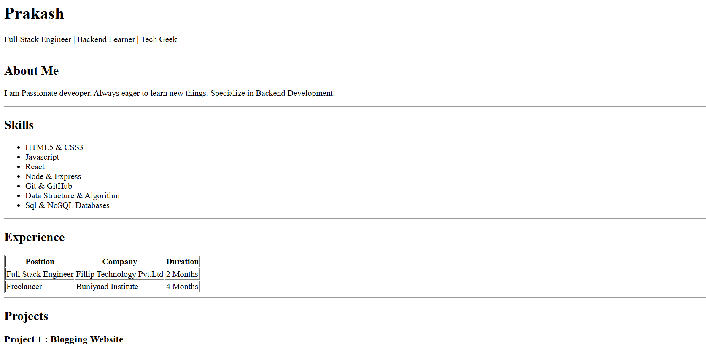

# Resume Website (HTML Only)

This project is a **resume website** built using **pure HTML** without any CSS or JavaScript.  
The goal of this assignment is to demonstrate proper **HTML structure, semantics, readability, and layout organization**.

## Live Project Link
[View Live Resume Website](https://iridescent-scone-1f228f.netlify.app/)
## Project Overview

The resume website includes the following sections:

- Header (Name & Role)
- About Me
- Skills
- Experience (Table)
- Projects
- Education (Table)
- Contact Information
- Footer

The layout is clean and structured using semantic HTML elements such as  
`<header>`, `<section>`, `<article>`, `<table>`, and `<footer>`.

---

## 🛠️ Technologies Used

- **HTML5**

> No CSS per assignment instructions.

---

## 📂 Project Structure
```bash
├── index.html
├── README.md
└── resume.png
```

---

## How to Run the Project

1. Clone the repository:
   ```bash
   git clone https://github.com/prakashtsx/chai-aur-cohort/tree/main/assignments/week-2/resume-page


2. Open the project folder:

3. Open `index.html` in your web browser to view the resume website.



---