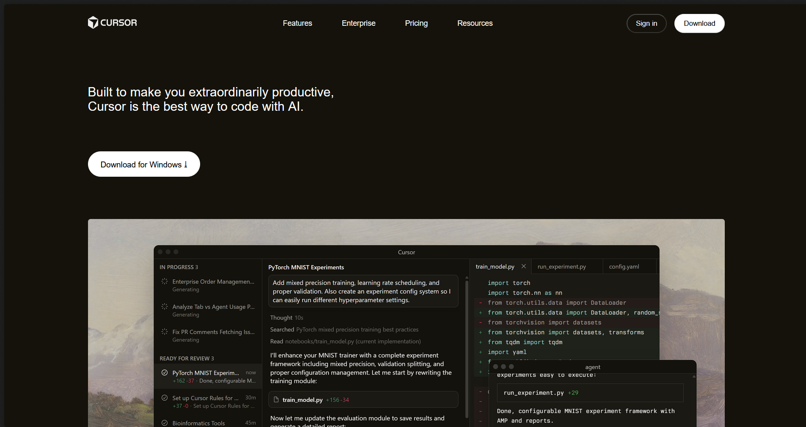

# Cursor Landing Page (Clone)

A static recreation of the Cursor landing page sections using HTML and CSS.

## Sections Recreated

- Navbar (logo, links, sign in, download)
- Hero (headline, CTA, hero image)
- Trusted by logos
- Feature cards (3 blocks)
- Testimonials grid
- Stories / stay on the frontier
- Changelog
- Careers banner
- Recent highlights
- Final CTA
- Footer

## Fonts Used

- CursorGothic (Regular, Italic, Bold, Bold Italic)

## Colors Used

- Background: #14120b, #15120b, #1a1913
- Text: #ffffff, #eeecec, #e6e6e6, #b3b3b3, #9a9a9a, #999997
- Accent: #bf420f, #ff6a00
- Hover/Muted: #808080, #bf420f90
- Borders/Overlays: rgba(255, 255, 255, 0.08), #23221b50
- Buttons: #ffffff (primary), #000000 (text)

## Screenshots

- Desktop: 

## Repository and Hosting

- Repository: [cursor-landing](https://github.com/prakashtsx/chai-aur-cohort/tree/main/assignments/week-3/cursor-landing)

- Live Webiste : [Click Here to View](https://cursorcloneweb.netlify.app/)
