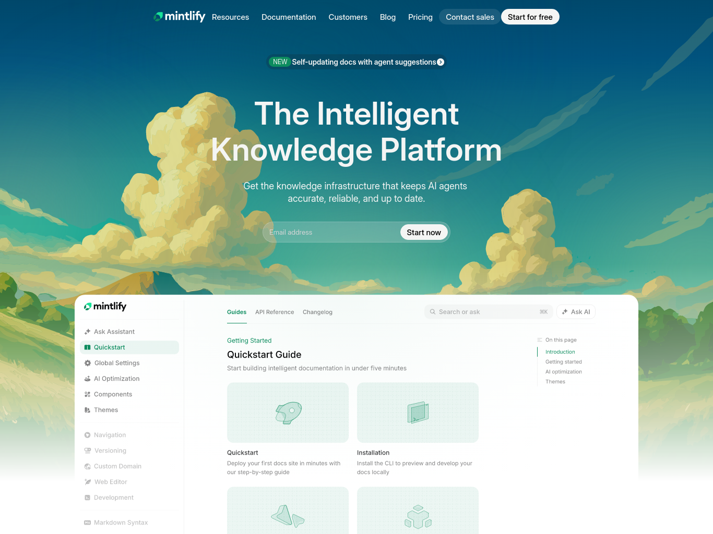

## Mintlify Clone

A pixel-perfect recreation of the Mintlify landing page, built entirely with HTML and CSS. This project replicates the modern design and layout of the Mintlify knowledge platform website.

### Overview

Mintlify is described as "The Intelligent Knowledge Platform" that provides knowledge infrastructure for keeping AI agents accurate, reliable, and up to date. This clone captures the essence of their landing page design with a clean, modern aesthetic.

### Sections Recreated

1. **Navbar** - Navigation header with logo, menu links (Resources, Documentation, Customers, Blog, Pricing), and CTA buttons (Contact sales, Start for free)

2. **Hero Section** - Main landing section featuring:
   - "NEW" badge with feature announcement
   - Large heading: "The Intelligent Knowledge Platform"
   - Subheading describing the product value proposition
   - Email input form with CTA button
   - Hero background illustration

3. **Trusted By Section** - Company logos showcasing clients including:
   - Anthropic
   - Coinbase
   - Microsoft
   - Perplexity
   - HubSpot
   - X (Twitter)
   - PayPal
   - Lovable

### Fonts & Colors Used

**Fonts:**

- **Inter** - Primary font for body text and headings (weights: 100-900, including italic variants)
  - Font sizes range from navigation elements (15px) to main headings
- **Geist Mono** - Monospace font for technical content (weights: 100-900)

**Color Palette:**

- **Primary Colors:**
  - Dark Green: `#1d4c56`
  - Light Green: `#45bc97`
  - Background: `#f4f5f4`

- **Accent Colors:**
  - Badge/Secondary: `#96b099`
  - Dark Brown: `#88600e`
  - Light Brown: `#d1d092`
  - Light Pink: `#bca794`
  - Blue: `#3a88c8`
  - Brown: `#b4ab48`

- **Text Colors:**
  - Primary Text White: `#f4f5f4`
  - Subheading: `#08090acc`
  - Black: `#000`

### Technologies Used

- **HTML5** - Semantic markup structure
- **CSS3** - Styling and layout (Flexbox for responsive design)
- **Google Fonts** - External font integration

### Project Structure

```
mintlify-clone/
├── index.html       # Main HTML structure
├── style.css        # Complete styling
├── README.md        # Documentation
└── assets/          # Images and SVG assets
    ├── mintlify-wordmark.svg
    ├── hero-image-light.svg
    ├── bg-light.svg
    └── [company logos]
```

### How to Use

1. Open `index.html` in a web browser to view the landing page
2. All styling is contained in `style.css`
3. Assets required for proper display are stored in the `assets/` folder

### Features

- Clean, modern design following current web design trends
- Responsive navbar with proper spacing and alignment
- Gradient overlays and background illustrations
- Company logo showcase section
- Email signup form ready for integration
- Consistent typography hierarchy

### Screenshots


